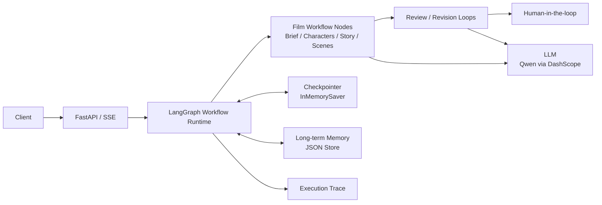
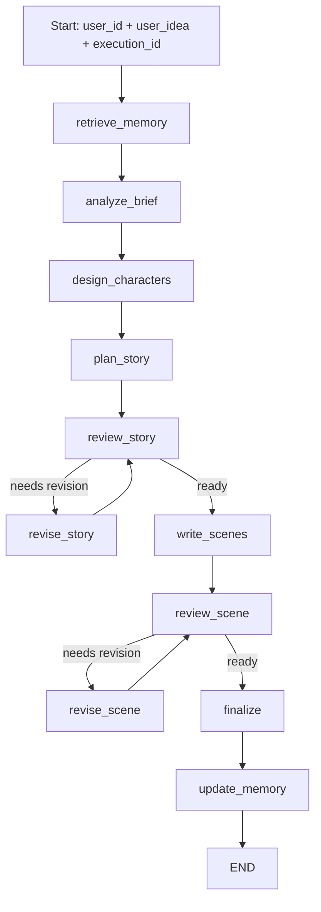
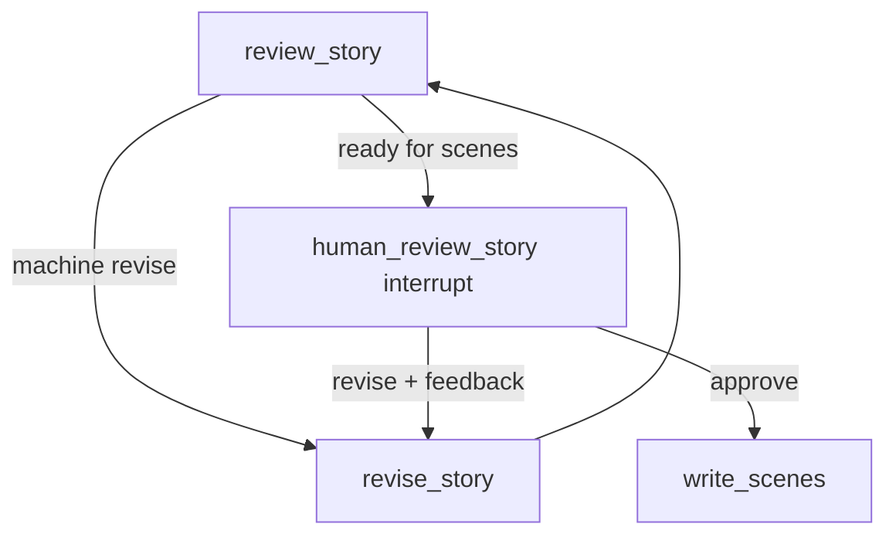

# Mini Film Agent

一个基于 LangGraph 的有状态短片策划 Agent Workflow：系统从一句用户创意出发，依次完成需求解析、角色设定、故事大纲和分场规划，并通过 Story / Scene 双层 Review–Revision、Human-in-the-loop、历史问题追踪和长期 Memory，构建可审核、可修订、可持续适配用户偏好的创作闭环。

## 目录

- [核心能力与亮点](#核心能力与亮点)
- [系统架构](#系统架构)
- [Runtime Flow](#runtime-flow)
- [Review–Revision 与 Issue 状态追踪](#reviewrevision-与-issue-状态追踪)
- [HITL 暂停与恢复](#hitl-暂停与恢复)
- [长期 Memory](#长期-memory)
- [Execution Observability](#execution-observability)
- [Prompt 与 LLM Governance](#prompt-与-llm-governance)
- [一次 Query 的完整流动](#一次-query-的完整流动)
- [API 与最小使用示例](#api-与最小使用示例)
  - [普通生成](#普通生成)
  - [HITL Start](#hitl-start)
  - [HITL Resume](#hitl-resume)
- [技术栈与项目结构](#技术栈与项目结构)
- [快速启动与测试](#快速启动与测试)
- [Roadmap](#roadmap)
  - [当前版本](#当前版本)
  - [下一阶段演进](#下一阶段演进)
- [License](#license)

## 核心能力与亮点

- **LangGraph 状态工作流**：`FilmState` 串联创意、角色、故事、分场、审核、Memory、HITL 和 Trace。
- **Story / Scene 双层闭环**：故事大纲和分场规划分别审核、分别修订，避免一次性生成后直接结束。
- **结构化输出**：核心产物使用 Pydantic schema 约束，包括 `FilmBrief`、`StoryOutline`、`SceneList` 和 Review 结果。
- **Issue 状态追踪**：历史问题会被判断为 `resolved`、`unresolved`、`regressed`，并影响后续审核和修订。
- **Human-in-the-loop**：`film_hitl_graph` 在故事大纲完成后通过 LangGraph `interrupt()` 暂停，支持 `resume` 后继续执行。
- **Evidence-grounded Memory**：通过 Candidate Extraction、原文 Evidence Validation 和 Conservative Verification 保守形成全局、Story、Scene 长期偏好。
- **Execution Observability**：同时记录节点级 `execution_trace`、LLM 调用级 `llm_call_trace`，并聚合为 `ExecutionSummary`。
- **Prompt 与模型治理**：10 个 production Prompt 统一版本化，Prompt Registry / Renderer 与 LLM Profile Binding 解耦模板和模型配置。
- **FastAPI + SSE**：提供非流式生成、节点级流式输出，以及 HITL 启动 / 恢复接口。

## 系统架构



FastAPI 负责入口、响应模型和 SSE 事件；LangGraph 负责节点路由、循环、checkpoint 与恢复；Memory 和 Trace 分别承担长期偏好与单次执行审计。

## Runtime Flow

普通自动流程使用 `film_graph`：



带人工审核的流程使用独立 `film_hitl_graph`，只在 Story 大纲准备进入分场前暂停：



## Review–Revision 与 Issue 状态追踪

项目把审核和修订拆开处理：Review 只判断是否足以进入下一阶段，Revision 只做最小必要修改。

- Story 层：`review_story` 审核故事结构、因果逻辑、角色一致性和主题时长；失败时进入 `revise_story`，最多修订 3 轮。
- Scene 层：`review_scene` 审核字段、总时长、场景数量、角色一致性和分场语义；失败时进入 `revise_scene`，最多修订 2 轮。
- `issues` 表示阻断性问题，修订时必须处理。
- `suggestions` 表示非阻断建议，只作为参考。

审核历史会记录在 `story_review_history` 和 `scene_review_history` 中。历史 issue 的状态包括：

- `resolved`：当前版本中已不存在。
- `unresolved`：一直没有解决。
- `regressed`：之前已解决，但当前版本再次出现。

Revision 会把 `unresolved` / `regressed` / 旧格式 `unknown` 放入“仍需避免的历史问题”，把少量 `resolved` 放入“防回归提醒”，避免旧问题反复回潮。

## HITL 暂停与恢复

HITL 当前只接在 Story 大纲机器审核通过之后、`write_scenes` 之前。

暂停时，`human_review_story` 通过 `interrupt()` 返回可 JSON 序列化的审核材料，包括 `film_brief`、`characters`、`story_outline` 和 `story_review`。恢复时客户端提交：

```json
{
  "decision": "approve",
  "feedback": null
}
```

或：

```json
{
  "decision": "revise",
  "feedback": "结尾改成更加克制的开放式结局。"
}
```

`approve` 会继续进入分场生成；`revise` 会把人工反馈写入 State，回到 `revise_story`，之后再次审核并可能再次暂停。

当前 Checkpointer 使用 `InMemorySaver`，`thread_id` 复用 `execution_id`。这适合本地 demo 和 HITL 验证，但服务重启后 checkpoint 会丢失，也不适合多 worker 部署。

## 长期 Memory

Memory 保存的是跨多次生成仍然稳定的用户偏好，不保存某一次请求里的具体人物、地点、场次或剧情细节。

`UserMemory` 分为三类作用域：

- 全局偏好：`preferred_genres`、`style_preferences`、`disliked_elements`、`preferred_duration_sec`、`additional_preferences`
- Story 偏好：`story_preferences`
- Scene 偏好：`scene_preferences`

写入链路在 `finalize` 后执行：

```text
extract_memory_update → merge_user_memory → save_user_memory
```

Memory Formation 采用 precision-first 的证据链：

```text
Candidate Extraction
→ Evidence Validation
→ Conservative Verification
→ MemoryUpdate / Merge / Store
```

Candidate Extractor 只从用户输入和有效人工反馈提出带 `source`、原文 `evidence` 和 `claim_type` 的候选；代码层验证 evidence 必须真实存在于对应原文；Conservative Verifier 再判断它是否有充分证据成为跨任务长期偏好。不确定、单次任务参数和当前作品专属修改一律拒绝。系统不根据机器 Review、生成结果或 `final_output` 推测偏好。

合并阶段负责确定性空值过滤和去重；有真实增量时保存 JSON，状态为 `saved`，否则为 `skipped`。

消费侧按节点分层：

- `analyze_brief` 读取完整长期偏好。
- Story 节点使用 `format_story_memory_context()`，不读取 `scene_preferences`。
- Scene 节点使用 `format_scene_memory_context()`，同时读取 `story_preferences` 和 `scene_preferences`。

所有使用 Memory 的 Prompt 都明确：当前请求优先于长期 Memory，冲突时忽略 Memory。

## Execution Observability

观测数据分为三个层次：

- `execution_trace`：记录 Graph Node、执行状态、阶段和节点耗时。
- `llm_call_trace`：记录真实 LLM 调用对应的 Prompt 名称与版本、Profile、模型、温度、字符数、状态和耗时，不保存 Prompt 正文、模型响应或用户内容。
- `ExecutionSummary`：聚合节点次数、Review / Revision 轮次、Issue 最新状态、HITL 次数、Memory 状态，以及 LLM 调用数、活跃耗时、Prompt 版本和 Profile / Model 使用情况。

两类 Trace 都通过 State reducer 累积。HITL 使用同一 `execution_id` / `thread_id` 恢复时，Checkpoint 会保留暂停前后的完整记录；API 和 SSE 的终态响应返回轻量 `ExecutionSummary`，不会重复传输完整 `llm_call_trace`。

## Prompt 与 LLM Governance

10 个 production Prompt 均以 `prompt_name:v1` 注册，每个模板存放在独立 `.txt` 文件中，由 `PromptRegistry` 查找、`render_prompt()` 校验变量并渲染。运行时 `RenderedPrompt` 提供名称、版本和字符数，供 `llm_call_trace` 记录实际版本元数据。

模型配置独立放在 `llm_profiles/`：

- `fast`
- `balanced`
- `strong`
- `critical`

Prompt 通过 Binding 唯一关联到 Profile，再由统一 Factory 创建 structured LLM。当前四个 Profile 都保持 `qwen-plus`、`temperature=0`，因此这层治理没有改变现有模型行为；它建立的是 Prompt 版本与模型配置相互独立的边界，当前尚未实现动态模型路由。

## 一次 Query 的完整流动

1. API 入口生成 `execution_id`，并作为 LangGraph `thread_id`。
2. 构造初始 `FilmState`。
3. `retrieve_memory` 读取该用户长期 Memory。
4. `analyze_brief` 解析类型、主题、视觉风格、时长和推荐分场数量。
5. `design_characters` 生成主要角色与连续性约束。
6. `plan_story` 生成结构化故事大纲。
7. `review_story` / `revise_story` 完成 Story 层闭环。
8. `write_scenes` 生成分场规划。
9. `review_scene` / `revise_scene` 完成 Scene 层闭环。
10. `finalize` 汇总最终策划案。
11. `update_memory` best-effort 更新长期偏好。
12. API 返回 `final_output`、`execution_trace`、`memory_update_status` 和 `execution_summary`。

每条 TraceEvent 至少包含：

```json
{
  "execution_id": "exec_xxx",
  "node": "review_story",
  "status": "success",
  "stage": "story_review_completed",
  "duration_ms": 123.45
}
```

## API 与最小使用示例

接口列表：

- `GET /health`
- `POST /api/v1/films/generate`
- `POST /api/v1/films/stream`
- `POST /api/v1/films/hitl/start`
- `POST /api/v1/films/hitl/{execution_id}/resume`
- `POST /api/v1/films/hitl/stream/start`
- `POST /api/v1/films/hitl/stream/{execution_id}/resume`

### 普通生成

```bash
curl -X POST http://127.0.0.1:8000/api/v1/films/generate \
  -H "Content-Type: application/json" \
  -d '{
    "user_id": "demo_user_001",
    "user_idea": "生成一个60秒的校园毕业短片"
  }'
```

### HITL Start

```bash
curl -X POST http://127.0.0.1:8000/api/v1/films/hitl/start \
  -H "Content-Type: application/json" \
  -d '{
    "user_id": "demo_user_001",
    "user_idea": "生成一个克制表达的校园毕业故事"
  }'
```

如果暂停，响应中的 `status` 为 `waiting_for_human`，并返回 `review_payload`。

### HITL Resume

```bash
curl -X POST http://127.0.0.1:8000/api/v1/films/hitl/exec_xxx/resume \
  -H "Content-Type: application/json" \
  -d '{
    "decision": "revise",
    "feedback": "结尾改成更加克制的开放式结局。"
  }'
```

`decision` 只能是 `approve` 或 `revise`；`revise` 时 `feedback` 去除首尾空格后必须非空。

## 技术栈与项目结构

主要技术栈：

- Python
- LangGraph
- LangChain OpenAI-compatible client
- Pydantic
- FastAPI
- SSE

当前 LLM 由 `llm_profiles/` 统一配置，通过 DashScope OpenAI-compatible endpoint 调用：

```text
base_url = https://dashscope.aliyuncs.com/compatible-mode/v1
model = qwen-plus
env = DASHSCOPE_API_KEY
```

项目结构：

```text
mini_film_agent/
├── app/
│   ├── main.py          # FastAPI 非流式、SSE、HITL 接口
│   ├── schemas.py       # API 请求与响应模型
│   └── sse.py           # SSE 事件格式化
├── memory/
│   ├── models.py        # UserMemory / MemoryUpdate
│   ├── retrieve_memory.py
│   ├── extract_memory.py
│   ├── merge.py
│   ├── update_memory.py
│   ├── store.py
│   └── context.py       # Story / Scene Memory 上下文格式化
├── prompts/
│   ├── registry.py      # 版本化 Prompt Registry
│   ├── renderer.py      # 变量校验与模板渲染
│   ├── generation/
│   ├── review/
│   ├── revision/
│   └── memory/
├── llm_profiles/
│   ├── registry.py      # fast / balanced / strong / critical
│   ├── bindings.py      # prompt_name → profile
│   └── factory.py       # 统一模型与 structured output 创建
├── observability/
│   ├── llm_calls.py     # LLM 调用级 Trace
│   ├── models.py        # ExecutionSummary
│   └── summarize.py     # 执行级纯汇总函数
├── reviews/
│   ├── review_story.py
│   ├── review_scene.py
│   └── human_review_story.py
├── revisions/
│   ├── revise_story.py
│   └── revise_scene.py
├── scripts/
│   └── demo_hitl.py     # 本地 HITL 暂停与恢复验证脚本
├── tests/
├── graph.py             # film_graph / film_hitl_graph
├── nodes.py             # 需求、角色、故事、分场节点
├── schemas.py           # 影片策划结构化模型
└── state.py             # FilmState 与 Trace / History TypedDict
```

## 快速启动与测试

安装依赖：

```bash
python -m venv .venv
source .venv/bin/activate
pip install -r requirements-dev.txt
```

配置环境变量：

```bash
export DASHSCOPE_API_KEY="your_api_key"
```

启动 API：

```bash
uvicorn app.main:app --reload
```

本地运行自动 Graph：

```bash
python graph.py
```

本地验证 HITL：

```bash
python scripts/demo_hitl.py
```

运行测试：

```bash
pytest -q
```

## Roadmap

### 当前版本

- [x] 基于 LangGraph 的自动生成流程与独立 HITL 流程。
- [x] Story / Scene 双层 Review–Revision 闭环。
- [x] `issues` / `suggestions` 分层处理。
- [x] `resolved` / `unresolved` / `regressed` 历史问题状态追踪。
- [x] 全局、Story、Scene 分作用域长期 Memory。
- [x] Evidence-grounded Memory Formation、合并、JSON 持久化与节点消费。
- [x] FastAPI 非流式、SSE 流式及 HITL Start / Resume 接口。
- [x] 节点级 `execution_trace`、LLM 级 `llm_call_trace` 与 `ExecutionSummary`。
- [x] 10 个版本化 Prompt、Registry / Renderer 与统一 LLM Profile Binding。
- [x] 覆盖 Memory、Review History、Issue Status、HITL、API、SSE 和端到端链路的自动化测试。

### 下一阶段演进

当前版本已完成核心 Agent Workflow、基础 Prompt / LLM Governance 和执行级 Observability；后续主要聚焦持久化、成本治理、运行时可靠性和多模态创作能力。

- [ ] **持久化 Agent Runtime**：将 Checkpointer 升级为持久化存储，支持服务重启后的 HITL 恢复，并为多实例运行预留一致性设计。
- [ ] **Token / Cost 与执行历史**：补充 Token、成本统计和可持久化的历史执行查询。
- [ ] **动态模型路由与 Prompt 实验**：在现有 Profile Binding 上增加运行时路由，并建设 Prompt A/B 与评测平台。
- [ ] **LLM 调用可靠性**：补充完整的 retry、幂等和可恢复调用状态机。
- [ ] **多模态视觉预演**：接入图片与视频生成工具，根据角色设定和分场规划生成角色参考图、分镜图及短视频预演，并逐步补充异步任务轮询、失败重试、生成参数管理和资产结果回写。
- [ ] **存储与部署扩展**：将本地 JSON Memory 抽象为可替换 Store，并逐步补充鉴权、限流和多 worker 部署能力。

当前边界：

- Checkpointer 仍为 `InMemorySaver`，服务重启后状态丢失，尚无持久化执行历史。
- 尚未统计 Token 和 Cost。
- Profile 已统一治理，但尚无动态模型路由。
- Prompt 已版本化，但尚无 Prompt A/B 平台。
- LLM 调用已有状态与耗时 Trace，但尚无完整 retry / idempotency 状态机。

## License

This project is licensed under the MIT License. See [LICENSE](LICENSE) for details.
